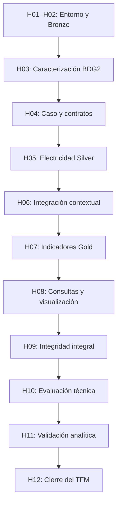

# Plan de hitos técnicos y seguimiento en GitHub

## Finalidad y situación de partida

Este documento es la **referencia principal del estado de los hitos H01–H12** y
relaciona los objetivos específicos OE1–OE7 con entregables verificables. Las
guías específicas mantienen los contratos y procedimientos; el README resume el
estado y enlaza aquí. Los expedientes privados identifican cada ejecución y no
se publican. Este registro no sustituye la aceptación académica ni el calendario
de entregas acordado por el equipo.

**Antecedente de planificación:** la situación inicial se describía en el [`README.md`](../README.md) y en la
[`guía de los hitos 1 y 2`](hitos-1-2.md): entorno local Spark/Delta verificado
y capa Bronze implementada con pruebas de software sobre datos sintéticos. Los
hitos posteriores se propusieron como planificados. Esa situación se conserva
como antecedente, no como descripción actual de H03. El contraste con la
caracterización preliminar de la memoria continúa pendiente.

## Catálogo de hitos

Los títulos de la segunda columna son los propuestos para los *milestones* de
GitHub. Su creación o cierre en GitHub no acredita por sí sola la finalización
técnica de un hito.

| ID | Título del milestone en GitHub | Resultado esperado | Objetivos del TFM | Dependencia |
| --- | --- | --- | --- | --- |
| H01 | `H01 - Entorno local Spark y Delta` | Entorno reproducible y comprobación efectiva de escritura y lectura Delta | OE2, OE3 | Ninguna |
| H02 | `H02 - Ingesta Bronze y trazabilidad` | Conservación de fuentes, snapshots Delta e inspección de versiones publicadas | OE2, OE3, OE6 | H01 |
| H03 | `H03 - Caracterización de las fuentes BDG2` | Procedencia, estructura, cobertura e incidencias verificadas sobre fuentes locales | OE1 | H02 para comparar con Bronze |
| H04 | `H04 - Selección del caso y contratos analíticos` | Selección justificada y contratos de Silver, calidad e integración aprobados | OE1, OE2, OE4 | H03 |
| H05 | `H05 - Silver de electricidad y calidad` | Electricidad en formato largo, trazable y con indicadores de calidad | OE3, OE4 | H04 |
| H06 | `H06 - Integración de metadatos y meteorología` | Enriquecimiento contextual validado y asociación meteorológica justificada, si procede | OE3, OE4 | H05 |
| H07 | `H07 - Indicadores Gold y comparativas` | Agregaciones por periodo, cobertura e indicadores normalizados válidos | OE3, OE5 | H06 o decisión sin meteorología |
| H08 | `H08 - Consultas y visualización analítica` | Consultas y visualizaciones locales para tareas de análisis definidas | OE5, OE7 | H07 |
| H09 | `H09 - Integridad y recuperación integral` | Consistencia entre capas, reejecución y recuperación ante fallos | OE3, OE6 | H05–H08 |
| H10 | `H10 - Evaluación técnica controlada` | Medidas reproducibles de rendimiento y comportamiento ante distintos volúmenes | OE6 | H09 |
| H11 | `H11 - Validación funcional y analítica` | Indicadores contrastados y evaluación de tareas representativas | OE4, OE5, OE7 | H08–H10 |
| H12 | `H12 - Reproducibilidad y cierre del TFM` | Documentación, evidencias, limitaciones y revisión final coherentes | OE1–OE7 | H11 |

## Estado actual y nivel de evidencia — 31/10/2026

La tabla conserva la situación histórica del 31/10/2026. Las novedades posteriores
se indican en la actualización fechada que aparece debajo.

Implementación, pruebas, ejecución real, auditoría y aceptación académica son
dimensiones distintas. Una aceptación técnica no acredita la aprobación global
del hito ni una nueva ejecución de una revisión posterior del código.

| Hito | Diseño e implementación | Pruebas y contraste técnico | BDG2 real | Decisiones y aceptación académica |
| --- | --- | --- | --- | --- |
| H01 | Implementado | Persistencia Delta con registros sintéticos; auditorías de entorno, Spark e Ivy | No es una validación BDG2 | No acredita resultados analíticos ni aceptación académica global |
| H02 | Bronze implementado | Regresiones sintéticas; correcciones AUD-01/AUD-02/AUD-05/AUD-08 | Expediente histórico `data/checks/bronze-hardening/`; sin reingesta en estas correcciones | No acredita calidad energética ni aceptación académica global |
| H03 | Subentregables técnicos disponibles | Evidencia desglosada a continuación | Ejecuciones históricas identificadas | **Cierre académico global pendiente** |
| Verificación de procedencia | Verificación de procedencia, variantes y SHA-256 documentada | Huellas contrastadas, recogidas en configuraciones y expedientes H03 | Identidad de los originales recibidos; sin inventar una ejecución independiente adicional | Aceptación global de fuentes y contraste con la memoria pendientes |
| Caracterización eléctrica y de metadatos (expediente histórico v1) | Caracterización eléctrica y de metadatos implementada | Pruebas y contraste independiente; cierre técnico con observaciones aceptado el 30/10/2026 | `2026-10-30-h03-2`, contrato `h03.2-v1` | Selección final, exclusiones y comparabilidad pendientes |
| Evolución técnica de la caracterización eléctrica (v2) | AUD-03/AUD-04 implementados: vinculación de procedencia y publicación exclusiva | Validado mediante pruebas sintéticas y regresiones | **No ejecutado nuevamente sobre BDG2 real** | No atribuir al expediente v1 las garantías automáticas v2 |
| Caracterización meteorológica y temporal | Meteorología y diagnóstico temporal implementados | Pruebas sintéticas y auditoría independiente con observaciones aceptada | `2026-10-30-h03-3`, contrato histórico `h03.3-v1` | Política temporal, integración y selección definitiva pendientes |
| H04 | Diseñado en su guía; no iniciado | Pendiente | No ejecutado | Selección del caso y contratos por aprobar |
| H05 | Planificado; no implementado | Pendiente | No ejecutado | Depende de H04 |
| H06 | Planificado; no implementado | Pendiente | No ejecutado | Integración temporal por justificar |
| H07 | Planificado; no implementado | Pendiente | No ejecutado | Fórmulas y comparabilidad por aprobar |
| H08 | Planificado; no implementado | Pendiente | No ejecutado | Tareas analíticas por definir |
| H09 | Planificado; no iniciado | Pendiente | No ejecutado | Recuperación entre capas por diseñar |
| H10 | Planificado; sin benchmark validado | Pendiente | No ejecutado | Protocolo de evaluación por aprobar |
| H11 | Planificado; no iniciado | Pendiente | No ejecutado | Validación funcional y analítica pendiente |
| H12 | Planificado; no iniciado | Pendiente | No ejecutado | Cierre del TFM pendiente |

### Actualización documental — 06/11/2026 (antecedente)

La transformación eléctrica a formato largo está implementada y versionada como entrega técnica preliminar. La [guía H05](hitos-5.md#verificación-sintética-y-límites)
registra 498 pruebas superadas el 01/11/2026, con datos sintéticos; esta revisión
documental no vuelve a ejecutarlas. No interpreta números o tiempos ni persiste
Silver, y no se ha validado con BDG2 real. H04 sigue pendiente de aprobación
conjunta; H05 formal, la interpretación numérica y temporal, H06 y Gold continúan pendientes.

La [guía de caracterización eléctrica](h03-2-characterization.md) y la
[guía de caracterización meteorológica](h03-3-weather-timezones.md) describen métodos y límites. Sus
`execution.json` privados identifican fecha, revisión y hashes originales;
no se regeneran para actualizar este registro. Los cambios de comentarios,
pruebas o contratos posteriores no se consideran nuevas ejecuciones reales.

La evolución conserva el plan inicial, las ejecuciones del 30/10/2026 y las
correcciones posteriores como hechos distintos. El resultado histórico de
AUD-05/AUD-08 —449 pruebas superadas y tres excluidas— se conserva en la
[guía H01–H02](hitos-1-2.md); no es un resultado atribuido a AUD-06/AUD-07.

### Actualización documental — 07/11/2026

**Nota posterior:** la guía H04 registra la ratificación conjunta comunicada de
los 16 identificadores. Las afirmaciones de esta actualización sobre una
aprobación pendiente reflejan el estado anterior a esa confirmación; H04 sigue
sin cerrarse y la reproducción y procedencia siguen pendientes.

**Actualización de integración eléctrica en Silver:** se ha incorporado la composición de las 16 columnas
aprobadas con las etapas de transformación a formato largo e interpretación numérica y temporal, sin lectura automática de snapshots ni
publicación Silver. El estado y la validación sintética constan en la guía H05;
el procesamiento real y el cierre formal siguen pendientes.

**Actualización del vínculo con la publicación Bronze:** el vínculo con una publicación Bronze identificada se
ha incorporado para configuraciones sintéticas. La guía H05 detalla los controles
y sus límites; no acredita procedencia externa ni autoriza procesamiento real.

**Actualización de publicación sintética en Silver:** se ha incorporado una publicación Silver Delta limitada
a directorios temporales sintéticos, con validación de contenido y recuperación
conservadora. La guía H05 recoge sus límites; no existe publicación Silver real.

H01 y H02 están implementados; las evidencias de H01 corresponden a Delta con
datos sintéticos y las de H02 incluyen regresiones sintéticas y expedientes
históricos de procedencia. No se infiere de esas pruebas calidad analítica ni una
nueva ejecución sobre BDG2. H03 dispone de caracterización y ejecuciones reales
históricas identificadas; la evolución técnica de la caracterización eléctrica conserva validación sintética, sin nueva
ejecución real, y el cierre académico global continúa pendiente.

H04 documenta el embudo y un conjunto final de 16 edificios seleccionados.
Según la confirmación metodológica comunicada por el autor informante el
07/11/2026, los límites de superficie son inclusivos
(`3.500 ≤ area_m2 ≤ 6.000`); se excluyen los tres
edificios de subcategoría `Hotel` y la regla de ausencia es estrictamente superior
al 8 %. Esta confirmación no equivale a ratificación conjunta. Siguen pendientes
la aprobación conjunta de la selección de edificios y la reproducción
verificable de la selección y procedencia desde las fuentes originales.

La transformación eléctrica a formato largo está implementada y validada con
datos sintéticos. La etapa siguiente añade la interpretación numérica y temporal
nominal, con validación sintética obligatoria completada: la evidencia histórica
registra 127 pruebas H05 superadas y una prueba del lector que escribe Delta
excluida. Esos resultados no son ejecuciones nuevas de esta actualización. No se
ha autorizado la validación Silver con BDG2 real ni la publicación de tablas
Silver en Delta. H05 formal sigue pendiente; integración meteorológica y Gold
permanecen fuera del alcance implementado.

Esta actualización corrige el estado vigente sin reescribir la tabla histórica
del 31/10, la actualización del 06/11 ni los resultados H03/H05 previamente
registrados. La revisión documental no ejecuta pruebas ni procesos de datos.

Los estados reflejan la evidencia disponible en el repositorio, **no** el
estado de GitHub. El cierre de H01 y H02 deberá revisarse antes de darlos por
completados en la herramienta de seguimiento.

### Motor estadístico IQR — H05

El incremento autorizado incorpora un motor sin persistencia para las 16 series
eléctricas, con cuartiles lineales exactos, señales conservativas y controles
separados de cobertura de observaciones y horas nominales. El contrato y la
verificación sintética se recogen en la [guía H05](hitos-5.md#motor-estadístico-iqr-y-controles-de-aceptación--h05).
Quedan pendientes la persistencia IQR versionada y su vinculación con Silver.
No constituye validación con BDG2 real ni cierre formal de H05.

## Riesgo técnico transversal AUD-09

`AUD-09 — Evaluado; tratamiento propuesto; aceptación del riesgo residual pendiente.`

El [registro técnico AUD-09](hitos-1-2.md#aud-09-riesgo-residual-de-dependencias-jvm)
documenta las versiones JVM afectadas, la comprobación estática complementaria,
las restricciones del perfil local CSV/Delta y los disparadores de reevaluación.
La propuesta es mantener provisionalmente ese perfil, sujeta a decisión expresa
de Carlos e Irantzu. Este estado no equivale a cierre ni aceptación del riesgo,
no modifica la aceptación académica de H03 y no autoriza avanzar a H04.
Las pruebas funcionales históricas permanecen separadas de esta revisión estática.

## Secuencia principal

```mermaid
flowchart TD
    A["H01–H02: Entorno y Bronze"] --> B["H03: Caracterización BDG2"]
    B --> C["H04: Caso y contratos"]
    C --> D["H05: Electricidad Silver"]
    D --> E["H06: Integración contextual"]
    E --> F["H07: Indicadores Gold"]
    F --> G["H08: Consultas y visualización"]
    G --> H["H09: Integridad integral"]
    H --> I["H10: Evaluación técnica"]
    I --> J["H11: Validación analítica"]
    J --> K["H12: Cierre del TFM"]
```

El diagrama representa las principales condiciones de avance. Las pruebas,
la revisión de resultados y la documentación se realizan durante todo el
proyecto. Algunas inspecciones de solo lectura pueden solaparse. La inclusión
de una actividad en esta planificación no autoriza automáticamente su ejecución.

## Guías detalladas

| Hito | Documento |
| --- | --- |
| H01–H02 | [`hitos-1-2.md`](hitos-1-2.md) |
| H03 | [`hitos-3.md`](hitos-3.md) |
| H04 | [`hitos-4.md`](hitos-4.md) |
| H05 | [`hitos-5.md`](hitos-5.md) |
| H06 | [`hitos-6.md`](hitos-6.md) |
| H07 | [`hitos-7.md`](hitos-7.md) |
| H08 | [`hitos-8.md`](hitos-8.md) |
| H09 | [`hitos-9.md`](hitos-9.md) |
| H10 | [`hitos-10.md`](hitos-10.md) |
| H11 | [`hitos-11.md`](hitos-11.md) |
| H12 | [`hitos-12.md`](hitos-12.md) |

## Responsabilidades

- **Carlos:** arquitectura Spark/Delta, procesos, persistencia, trazabilidad,
  reproducibilidad, recuperación y evaluación técnica.
- **Irantzu:** caracterización BDG2, selección del caso, modelo analítico,
  reglas de calidad, integración contextual, indicadores y validación analítica.
- **Ambos:** aprobación de contratos entre capas, revisión cruzada,
  interpretación de resultados y validación de la memoria.

Estas atribuciones son ámbitos de responsabilidad y no equivalen a asignaciones
automáticas a cuentas de GitHub.

## Condiciones generales para cerrar un hito

1. Alcance, dependencias, responsables, contratos y criterios de aceptación
   aprobados antes de implementar cambios sustanciales.
2. Documentación pública y prosa académica en español de España. Código,
   identificadores, nombres de pruebas, docstrings y comentarios técnicos
   necesarios en inglés, conservando comandos y contratos.
3. CSV originales BDG2 inalterados y excluidos de Git; entradas y salidas
   separadas. Las pruebas sintéticas no acreditan conclusiones energéticas.
4. Pruebas pertinentes realmente ejecutadas, con comando, revisión de código,
   entorno, resultados y comprobaciones no realizadas.
5. Estado de la evidencia declarado con precisión: **diseñado**,
   **implementado**, **probado con datos sintéticos**,
   **validado con BDG2 real** o **medido**.
6. Anomalías, registros excluidos, versiones, linaje, recuperación y límites
   de comparabilidad documentados cuando correspondan.
7. Revisión cruzada de decisiones analíticas y afirmaciones de la memoria.
   Los mensajes de cambios siguen Conventional Commits. El versionado y la
   publicación del repositorio corresponden a los autores.

## Convención de nomenclatura

Los únicos identificadores de hito son H01–H12. Las actividades de cada hito se
identifican mediante títulos descriptivos, sin códigos jerárquicos nuevos. Los
códigos históricos o técnicos solo se conservan cuando forman parte de una
referencia reproducible y se explicita su función.

## Uso de milestones e issues en GitHub

Crear un *milestone* por resultado técnico aceptado y dividir su trabajo en
*issues* pequeños y verificables. Los títulos recomendados figuran en la tabla
anterior y las tareas sugeridas, en cada guía de hito.

El archivo [`github-milestones.json`](github-milestones.json) contiene 12
objetos independientes con `title`, `state` y `description`, preparados para
una futura creación mediante la API de GitHub. **No crea hitos por sí mismo**;
antes de utilizarlo es necesario revisar los milestones existentes para evitar
duplicados. Tampoco debe enviarse el array completo como si fuera un único
milestone.

Recomendaciones de seguimiento:

- Mantener una única responsabilidad clara por issue y revisar las
  dependencias antes de iniciarlo.
- Incorporar el prefijo `[H03]`, `[H04]`, etc. al título de las tareas.
- No establecer fechas ficticias: deben aprobarse según el calendario real
  de entregas académicas.
- Cerrar cada issue con sus pruebas y evidencias; cerrar un milestone
  únicamente cuando se hayan satisfecho todos los criterios obligatorios.
- Registrar por separado los bloqueos que necesiten una decisión conjunta.

Las definiciones incluidas aquí **no significan que ya existan milestones
o issues creados en GitHub**.

## Siguiente actividad recomendada — antecedente de planificación

**`[H03] Contrastar las evidencias técnicas con la memoria y resolver las decisiones abiertas`**.

La primera verificación de rutas y huellas era la recomendación del plan inicial
y ya tiene evidencia. No se propone repetirla como si estuviera sin iniciar.
Quedaban por aceptar globalmente las fuentes, justificar la selección y las
exclusiones y acordar la política temporal antes de avanzar a H04. La situación
actual de H04 y H05 se recoge en la actualización del 07/11/2026; esta sección
conserva la recomendación de planificación original. Los criterios se detallan en
[`hitos-3.md`](hitos-3.md).
